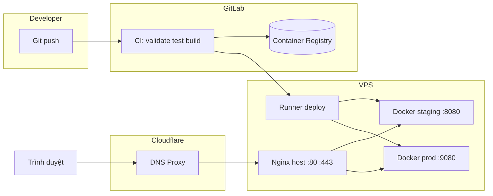

# Kiến trúc triển khai — travel-vn-fe

Tài liệu mô tả luồng từ **GitLab CI/CD** → **Container Registry** → **VPS** (Docker Compose + Nginx host + Cloudflare), dựa trên `Dockerfile`, `docker-compose.*.yml` và `.gitlab-ci.yml`.

---

## 1. Tổng quan

| Thành phần | Vai trò |
|------------|---------|
| **GitLab CI** | Lint, typecheck, test, build image, deploy theo branch |
| **GitLab Container Registry** | Lưu image `staging-*` / `prod-*` và tag `*-latest` |
| **VPS** | Chạy `docker compose` pull image, container Nginx phục vụ static SPA |
| **Nginx trên host** (cài trên OS) | Lắng nghe **:80** (redirect HTTPS) và **:443** (TLS), reverse proxy vào container qua localhost |
| **Cloudflare** | DNS proxy, SSL edge, kết nối origin theo chế độ **Full** (HTTPS tới cổng **443**) |

Một image Docker dùng chung cho staging và production; khác biệt nằm ở **biến build `VITE_*`** và **tag image** khi build trên CI.

---

## 2. Pipeline GitLab CI (`.gitlab-ci.yml`)

### 2.1 Các stage (theo thứ tự)

1. **validate** — `lint` (ESLint), `typecheck` (`tsc --noEmit`), song song.
2. **test** — `yarn test --coverage`.
3. **build** — chỉ khi branch tương ứng:
   - Branch **`staging`** → `build:staging` (Docker-in-Docker).
   - Branch **`production`** → `build:production`.
4. **deploy** — chỉ khi branch tương ứng:
   - **`deploy:staging`** (tag runner `travel-staging`).
   - **`deploy:production`** (tag runner `travel-production`).

Các branch khác: chỉ chạy **validate** + **test**, không build/deploy.

### 2.2 Runner và thư mục trên VPS

Job deploy **không** dùng SSH trong script hiện tại; runner thực thi lệnh trực tiếp (shell executor trên máy có Docker), ví dụ:

- Staging: `cd /opt/travel-fe/staging` → `docker compose -f docker-compose.staging.yml ...`
- Production: `cd /opt/travel-fe/production` → `docker compose -f docker-compose.production.yml ...`

Trên VPS cần có sẵn file compose + biến môi trường (hoặc `.env`) để `CI_REGISTRY_IMAGE` và `IMAGE_TAG` khớp với image vừa build.

### 2.3 Build image

- Image build: `docker:27` + service `docker:27-dind`.
- Đăng nhập registry: `docker login` bằng biến có sẵn của GitLab.
- **Build args** (từ CI Variables, scope theo environment):  
  `VITE_API_BASE_URL`, `VITE_SOCKET_URL`, `VITE_APP_API_URL`, `VITE_STRIPE_PUBLIC_KEY`, `VITE_DROP_CONSOLE`.

**Tag:**

| Branch | Tag đẩy lên registry |
|--------|----------------------|
| `staging` | `staging-<short_sha>`, `staging-latest` |
| `production` | `prod-<short_sha>`, `prod-latest` |

### 2.4 Deploy

- **Staging:** `IMAGE_TAG=staging-$CI_COMMIT_SHORT_SHA` → `pull` → `up -d --force-recreate` → `sleep 10` → `curl -f http://127.0.0.1:8080/health`.
- **Production:** `IMAGE_TAG=prod-$CI_COMMIT_SHORT_SHA` → tương tự → `curl -f http://127.0.0.1:9080/health`.

---

## 3. Image Docker (`Dockerfile`)

Multi-stage, một image phục vụ static SPA:

| Stage | Mục đích |
|-------|----------|
| **deps** | `yarn install --frozen-lockfile` (tối ưu cache layer) |
| **builder** | Inject `VITE_*` qua `ARG`/`ENV`, chạy `yarn build` → thư mục `dist/` |
| **runner** | `nginx:1.27-alpine`, copy `dist/`, copy `nginx.conf` → `/etc/nginx/conf.d/default.conf`, Nginx listen **cổng 80 trong container** |

Trong container, Nginx xử lý SPA fallback, cache asset, gzip, header bảo mật, endpoint **`/health`**.

---

## 4. Docker Compose trên VPS

### 4.1 Production (`docker-compose.production.yml`)

- Service: `web-production`, container name: `frontend-production`.
- **Port:** `127.0.0.1:9080:80` — chỉ lắng nghe trên localhost; không expose trực tiếp ra Internet.
- Image: `${CI_REGISTRY_IMAGE}:${IMAGE_TAG}` (mặc định tag `prod-latest` nếu không set).
- Network: `travel-vn-network` (bridge).
- Resource limits / logging / healthcheck nội bộ container (wget `/health`).

### 4.2 Staging (`docker-compose.staging.yml`)

- Service: `web-staging`, container name: `frontend-staging`.
- **Port:** `127.0.0.1:8080:80`.
- Image tag mặc định: `staging-latest`.
- Network: `travel-vn-dev-network`.

Cả hai môi trường đều **không** bind công khai `0.0.0.0` cho app — lưu lượng người dùng đi qua **Nginx host** (và Cloudflare).

---

## 5. Nginx trên host + Cloudflare

File tham khảo: `deploy/host-nginx/cloudflare-full.origin.conf.example`.

- **:80** — `server_name` khớp domain; `return 301` sang HTTPS.
- **:443** — TLS bằng **Cloudflare Origin Certificate**; `proxy_pass`:
  - `travel-vn.site` / `www` → `http://127.0.0.1:9080`
  - `staging.travel-vn.site` → `http://127.0.0.1:8080`

Cloudflare (chế độ **Full**) kết nối HTTPS tới origin cổng **443**; chứng chỉ đặt trên Nginx host, không nằm trong image frontend.

---

## 6. Sơ đồ luồng (tóm tắt)

---

## 7. Biến GitLab CI (tham khảo header `.gitlab-ci.yml`)

Cấu hình trong **Settings → CI/CD → Variables** (thường scope theo environment **staging** / **production**):

- `VITE_*` — inject lúc **build** image (đã liệt kê ở trên).
- Ghi chú trong file CI còn đề cập `VPS_HOST`, `VPS_USER`, `SSH_PRIVATE_KEY` — phù hợp nếu sau này chuyển sang deploy qua SSH từ runner tách khỏi VPS; **flow deploy hiện tại** dùng runner trên máy chủ và thư mục cố định `/opt/travel-fe/...`.

---

## 8. Checklist vận hành nhanh

- [ ] DNS (Cloudflare) trỏ về IP VPS; proxy cam bật nếu dùng CDN/SSL edge.
- [ ] Origin **443** mở firewall; Nginx host đã load cert và `proxy_pass` đúng **9080** / **8080**.
- [ ] Trên VPS có `docker-compose.staging.yml` / `docker-compose.production.yml` và quyền pull registry.
- [ ] Sau deploy: health CI pass (`/health` trên localhost **8080** / **9080**).

---

*Tài liệu phản ánh trạng thái repo tại thời điểm tạo; khi đổi port, path VPS hoặc pipeline, nên cập nhật file này cho đồng bộ.*
